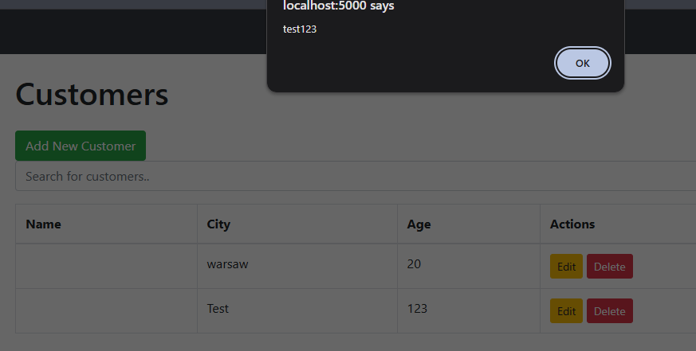
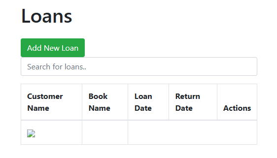
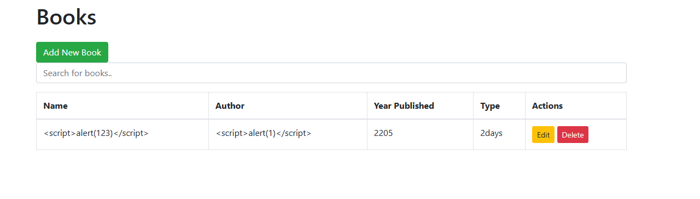
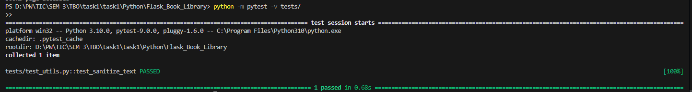

# XSS
## Sprawdzanie czy jest podatność
Podatność XSS (Cross Site Scripting) została wykryta w modułach **Books** oraz **Customers** wprowadzając następujące dane w dane wejściowe: 
```<script>alert(1)</script>```. Pokazano poniżej

Spowodowało to wyświetlenie komunikatu typu alert, potwierdzając możliwość wstrzyknięcia i wykonania skryptu JS po stronie przeglądarki.

Dodatkowo w części Loans, po wykorzystaniu wcześniejszych danych klienta w celu wypożyczenia książki, ponownie występuje XSS dodatkowo w sekcji Loans teraz nie można dodawać ani usuwać akcji.



## Gdzie znaleziono podatność podatność 
```
    new_book = Book(name=data['name'], author=data['author'], year_published=data['year_published'], book_type=data['book_type'])

    try:
        # Add the new book to the session and commit to save to the database
        db.session.add(new_book)
        db.session.commit()
        print('Book added successfully')
        return redirect(url_for('books.list_books'))
```
---
Oraz
```
            # Create a new loan and store original book details
            new_loan = Loan(
                customer_name=customer_name,
                book_name=book_name,
                loan_date=loan_date,
                return_date=return_date,
                original_author=book.author,
                original_year_published=book.year_published,
                original_book_type=book.book_type
            )

            # Add the new loan to the database
            db.session.add(new_loan)
            db.session.commit()
```
Dane użytkownika były zapisywane do bazy danych bez walidacji, następnie renderowane w HTML bez kodowania znaków.
---


## Jakie poprawy by powstrzymać XSS

Są 4 główne sposoby zapobiegania XSS i są to:
- Filtrowanie danych wejściowych np w celu otrzymania jedynie takich danych jakich się spodziewamy.
- Szyfrowanie danych wyjściowych.
- Korzystanie z odpowiednich response headerów w celu zapobiegania odpowiedzi HTTP, których się nie spodziewamy, aby miały HTML czy JavaScript.
- CSP (Content Security Policy) - Zmniejszy to skalę w jakiej XSS może wystąpić, w przypadku, gdyby poprzednie zasady były nie wystarczające.

### Jakich kroków użyto:
- Stworzenie osobnego pliku **utils.py** zawierającego nowe narzędzie sanitize_text. Służący ono do filtrowania dancych wejściowych. Sprawdza dane zanim zostaną zapisane do bazy danych. Pozwalamy tylko na oczekiwane znaki, długości oraz typy danych. Dodatkowo usuwamy wszystkie tagi HTML czy JS z pól tekstowych.

- Szyfrowanie danych wyjściowych poprzez <p>{{ book.name }}</p> (czyli usunięcie | safe tam, gdzie to możliwe). W ten sposób żadne tagi nie powinny być interpretowane przez przeglądarkę więc, gdyby do bazy przypadkiem trafił tag HTML to nie powinien się wykonać.
- Odpowiednie nagłówki HTTP, czyli blokujemy takie jak X-Content-Type-Options czy X-Frame-Options. W ten sposób przeglądarka wymusza bezpieczne traktowanie danych.
- Definiujemy politykę bezpieczeństwa, w ten sposób ograniczając skąd można ładować skrypty i zasoby. 

Po zastosowaniu poprawek nie występuje już XSS.


## Testy
Wykorzystano bibliotekę pytest i stworzono następujący test:

```
from project.utils import sanitize_text

def test_sanitize_text():
    # Test 1: usuwa <script>
    input_text = '<script>alert(1)</script>'
    expected = 'alert(1)'
    assert sanitize_text(input_text) == expected

    # Test 2: usuwa onerror w tagach 
    input_text = ''
    expected = ''
    assert sanitize_text(input_text) == expected

    # Test 3: pozostawia normalny tekst
    input_text = 'Normal Text'
    expected = 'Normal Text'
    assert sanitize_text(input_text) == expected

    # Test 4: usuwa mieszane tagi i atrybuty
    input_text = '<b>Bold</b> <a href="x" onclick="alert(3)">link</a>'
    expected = 'Bold link'
    assert sanitize_text(input_text) == expected

    # Test 5: obsługa pustego stringa
    input_text = ''
    expected = ''
    assert sanitize_text(input_text) == expected

    # Test 6: obsługa None
    input_text = None
    expected = ''
    assert sanitize_text(input_text) == expected
```

